# 🚀 Awesome Remote Monitoring &amp; Management (RMM) 

  
  
  
  
  
  

  

---

## 📖 Executive Summary &amp; Overview

Welcome to the definitive, community-maintained index of **Remote Monitoring &amp; Management (RMM)** solutions, **Managed Service Provider (MSP)** tooling, **Unified Endpoint Management (UEM)** platforms, and self-hostable open-source systems.

Remote Monitoring and Management (RMM) platforms serve as the nerve center for IT departments, systems administrators, and Managed Service Providers (MSPs). Modern RMM platforms empower IT teams to:
- 🖥️ **Centralize Endpoint Fleet Visibility:** Monitor health, hardware metrics, CPU/memory consumption, and event logs across heterogeneous Windows, macOS, and Linux estates.
- ⚡ **Automate OS &amp; Third-Party Patch Management:** Audit CVE vulnerabilities, schedule unattended reboot windows, and deploy critical security updates automatically.
- 🔐 **Deliver Secure Remote Control:** Launch background terminal sessions, remote PowerShell/Bash prompts, file transfer managers, and low-latency remote desktop control.
- 🤖 **Run Automated Remediation Scripts:** Execute policy-driven self-healing playbooks, software installations, and proactive maintenance tasks without user disruption.
- 📊 **Integrate with PSA &amp; Ticketing:** Synchronize asset inventories, generate incident tickets, and track Service Level Agreements (SLAs).

---

## 📑 Table of Contents

- [📊 Market Dynamics &amp; Size](#-market-dynamics--size)
- [🏢 SaaS &amp; Commercial Hosted Platforms](#-saas--commercial-hosted-platforms)
- [🌐 Open-Source GitHub Projects](#-open-source-github-projects)
- [🔍 Key Architectural Building Blocks](#-key-architectural-building-blocks)
- [⚖️ SaaS vs. Self-Hosted Open-Source: Evaluation Criteria](#️-saas-vs-self-hosted-open-source-evaluation-criteria)
- [📈 Star History](#-star-history)
- [🤝 How to Contribute](#-how-to-contribute)
- [⚠️ Disclaimer](#️-disclaimer)

---

## 📊 Market Dynamics &amp; Size

> 💡 **Estimated Market Size &amp; Industry Structure:** The Global Remote Monitoring &amp; Management (RMM) software sector is estimated at **$4.8 Billion to $5.5 Billion in 2025/2026** and is projected to surpass **$14.2 Billion by 2034, registering a compound annual growth rate (CAGR) of 12.8%**. The market is **moderately fragmented**: an oligopoly of private-equity-backed enterprise giants (such as Kaseya/Datto, ConnectWise, N-able, and NinjaOne) commands significant legacy MSP market share, while dynamic innovators with technician-based pricing and automated vulnerability patching (such as Atera, Syncro, SuperOps, and Action1) continue to capture rapid market expansion.

---

## 🏢 SaaS &amp; Commercial Hosted Platforms

The table below catalogs leading commercial SaaS RMM platforms, sorted in **descending order by company scale** (estimated valuation or annual revenue).

| 🏢 Platform | 💰 Company Size (Valuation / Revenue) | 🏷️ Starting Pricing Tier | 🎁 Free Tier Limit / Trial Duration | 🛠️ Core Focus &amp; Key Capabilities |
| :--- | :--- | :--- | :--- | :--- |
| **[ManageEngine Endpoint Central](https://www.manageengine.com/products/desktop-central/)** | **Valuation: ~$10.0B+** *(ARR: $1.2B+ via Zoho Corp)* | **$795 / year** *(~$66.25/mo for 50 endpoints, Professional Edition)* | **Free Forever Plan: up to 25 endpoints** *(Fully functional OS &amp; third-party patching, asset inventory, remote desktop, no credit card required)* | Comprehensive Enterprise Unified Endpoint Management (UEM), automated patching for 1,000+ apps, mobile device management (MDM), asset tracking. |
| **[ConnectWise Automate / RMM](https://www.connectwise.com/)** | **Valuation: ~$6.0B – $8.0B** *(ARR: ~$1.0B – $1.2B via Thoma Bravo)* | **$2.50 – $3.50 / endpoint / month** *(Entry contract minimum ~$150/month)* | **14-day free trial** *(Up to 50 endpoints with full automation engine, patch management, ScreenConnect integration)* | Deep scripting automation engine, extensive multi-tenant MSP workflows, native integration with ConnectWise PSA and ScreenConnect remote access. |
| **[Datto RMM](https://www.datto.com/products/rmm/)** | **Valuation: $6.2B** *(Acquisition price; Kaseya Group ARR: ~$1.5B)* | **$1.70 – $3.00 / endpoint / month** *(Typical minimum base commit ~$65 – $100/month)* | **14-day free trial** *(Up to 50 endpoints, unrestricted policy-based patch engine, remote terminal, no credit card required)* | 100% cloud-based MSP RMM, native synchronization with Datto BCDR backup appliances, automated Windows/macOS patching, policy-based monitoring. |
| **[NinjaOne](https://www.ninjaone.com/)** | **Valuation: $1.9B** *(Series C in 2024; ARR: ~$200M+)* | **$2.20 – $3.20 / device / month** *(Minimum monthly spend typically $150/mo or 50 devices)* | **14-day free trial** *(Up to 50 endpoints, full cross-platform patching, endpoint backup module, remote command suite)* | Fast modern web UI, cross-platform patching (Windows, Mac, Linux), integrated endpoint backup, robust automation engine, highly rated customer support. |
| **[N-able (N-central / N-sight)](https://www.n-able.com/)** | **Valuation: ~$1.4B Market Cap** *(NYSE: NABL; Revenue: ~$460M/yr)* | **$99.00 / month** *(N-sight Essentials base package, includes up to 100 endpoints)* | **30-day free trial** *(Up to 100 endpoints, includes Take Control remote access, automated patch manager, ticketing)* | Flexible dual architecture (cloud N-sight or on-prem/cloud N-central), rule-based automation, integrated Take Control remote desktop, network topology mapping. |
| **[Atera](https://www.atera.com/)** | **Valuation: ~$500M** *(Series B; ARR: ~$50M – $65M)* | **$99.00 / technician / month** *(Pro Plan, billed annually; covers **unlimited endpoints**)* | **30-day free trial** *(Unlimited endpoints, includes all RMM tools, PSA ticketing, billing engine, AI Copilot, no credit card required)* | Disruptive flat per-technician pricing with unlimited managed devices, native RMM + PSA, AI-powered automated ticket summary and scripting assistants. |
| **[SuperOps](https://superops.com/)** | **Valuation: ~$90M – $100M** *(Series B; ARR: ~$15M)* | **$59.00 / technician / month** *(RMM Standard, billed annually; Unified RMM+PSA at $79/tech/mo)* | **14-day free trial** *(Unlimited endpoints, full PSA ticketing, intelligent alert deduplication, patch management, no credit card required)* | Modern human-centric UI, AI-assisted alert deduplication and asset runbooks, unified PSA + RMM console, network monitoring integrations. |
| **[Pulseway](https://www.pulseway.com/)** | **Valuation: ~$75M – $100M** *(Kaseya subsidiary; ARR: ~$25M – $35M)* | **$2.20 / workstation &amp; $3.85 / server / mo** *(Base entry minimum starting package ~$57/month)* | **14-day free trial** *(Up to 5 endpoints, includes full iOS/Android native mobile control, push notifications, real-time command execution)* | Mobile-first architecture with native iOS/Android administrative apps, instant push notifications, remote PowerShell/SSH console from smartphones. |
| **[Action1](https://www.action1.com/)** | **Valuation: ~$60M – $80M** *(High-growth bootstrapped; ARR: ~$20M)* | **$2.00 / endpoint / month** *(Applicable for endpoint counts beyond the free tier)* | **Free Forever Plan: up to 100 endpoints** *(Fully functional, automated OS &amp; third-party software patching, vulnerability scanning, unlimited duration)* | Cloud-native vulnerability discovery, automated third-party software patching, lightweight P2P patch distribution architecture, unattended remote desktop. |
| **[Syncro](https://syncromsp.com/)** | **Valuation: ~$50M – $75M** *(Mainsail Partners; ARR: ~$25M)* | **$139.00 / technician / month** *(Core plan, billed annually; covers **unlimited endpoints**)* | **21-day free trial** *(Unlimited endpoints, complete RMM and PSA suite, automated recurring billing, background tools, no credit card required)* | Combined RMM &amp; PSA without per-device fees, automated client billing, embedded PowerShell scripting library, remote background tools (registry, task manager). |
| **[GFI LanGuard / GFI Software](https://www.gfi.com/products-and-solutions/network-security-solutions/gfi-languard)** | **Valuation: ~$50M – $70M** *(Aurea Software; ARR: ~$30M)* | **$26.00 / node / year** *(~$2.17/endpoint/mo for 10–49 nodes, billed annually)* | **30-day free trial** *(Up to 25 endpoints, full network vulnerability scanning engine, automated security patch testing)* | Network vulnerability scanning, automated cross-platform patch management for 60+ major third-party software vendors, compliance auditing (PCI-DSS, HIPAA). |

---

## 🌐 Open-Source GitHub Projects

The following table presents open-source RMM platforms, endpoint managers, remote support agents, and fleet orchestration tools, **sorted in descending order by GitHub_Stars**.

| 📦 Repository &amp; Project | ⭐ GitHub_Stars (Social) | 💻 Tech Stack | 🎯 Description &amp; Core RMM Use Cases |
| :--- | :--- | :--- | :--- |
| **[RustDesk](https://github.com/rustdesk/rustdesk)** *(rustdesk/rustdesk)* |  | Rust, Flutter | Open-source virtual/remote desktop infrastructure and high-performance remote access software. Often deployed as a self-hosted TeamViewer/AnyDesk replacement in custom RMM architectures. |
| **[MeshCentral](https://github.com/Ylianst/MeshCentral)** *(Ylianst/MeshCentral)* |  | Node.js, JavaScript, C | Web-based remote management and remote control portal. Provides web-based remote desktop (RDP/VNC), terminal, file transfer, and Intel AMT hardware-level out-of-band management. |
| **[Fleet](https://github.com/fleetdm/fleet)** *(fleetdm/fleet)* |  | Go, TypeScript, Osquery | Open-source device management and endpoint operations engine powered by osquery. Real-time telemetry, vulnerability detection, and MDM policy assertions across Windows, macOS, Linux, and ChromeOS. |
| **[GLPI](https://github.com/glpi-project/glpi)** *(glpi-project/glpi)* |  | PHP, JavaScript | Comprehensive open-source IT asset management (ITAM), service desk (ITSM), and endpoint inventory system. Supports agent-based discovery, license tracking, and financial lifecycle accounting. |
| **[Remotely](https://github.com/immense/Remotely)** *(immense/Remotely)* |  | C#, .NET 8, Blazor | Open-source remote control, desktop sharing, and remote scripting solution. Features fast WebRTC streaming, multi-session management, command-line orchestration, and self-hosted server deployment. |
| **[Tactical RMM](https://github.com/amidaware/tacticalrmm)** *(amidaware/tacticalrmm)* |  | Django, Vue.js, Go | The benchmark full-featured open-source RMM platform built specifically for MSPs and sysadmins. Features automated Windows patching, script scheduling, alerts, and native MeshCentral integration. |
| **[Apache Guacamole](https://github.com/apache/guacamole-server)** *(apache/guacamole-server)* |  | C, Java, JavaScript | Clientless remote desktop gateway supporting standard protocols like VNC, RDP, and SSH over HTML5. Enables browser-based remote endpoint control without client-side plugins. |
| **[OCS Inventory](https://github.com/OCSInventory-NG/OCSInventory-Server)** *(OCSInventory-NG/OCSInventory-Server)* |  | Perl, PHP, C++ | Open Computer and Software Inventory Next Generation. Enables automated hardware/software discovery, network device scanning, and mass package deployment across distributed networks. |
| **[NetLock RMM](https://github.com/0x101-Cyber-Security/NetLock-RMM)** *(0x101-Cyber-Security/NetLock-RMM)* |  | Go, Python, React | Modern open-core RMM engineered in Germany. Focuses on endpoint telemetry, patch deployment, remote management, and compliance auditing for privacy-conscious organizations. |
| **[OpenUEM](https://github.com/open-uem/openuem-console)** *(open-uem/openuem-console)* |  | Go, TypeScript, Svelte | Open-source Unified Endpoint Management platform console. Delivers cross-platform endpoint inventory, remote script execution, system updates, and certificate-backed agent authentication. |
| **[Breeze](https://github.com/LanternOps/breeze)** *(LanternOps/breeze)* |  | TypeScript, Node.js | Next-generation open-source IT platform unifying RMM and PSA workflows. Integrates an autonomous, governed AI operator for incident triage, script verification, and automated ticket resolution. |
| **[Endar](https://github.com/tomkeene/endar)** *(tomkeene/endar)* |  | Python, Shell | Lightweight open-source RMM tool designed for Windows, Linux, and macOS. Focuses on policy-based compliance assertions, automated remediation runbooks, and endpoint health reporting. |
| **[Borealis](https://github.com/bunny-lab-io/Borealis)** *(bunny-lab-io/Borealis)* |  | Go, React | Cross-platform device automation, remote command dispatch, and fleet monitoring solution for distributed enterprise workstations. |
| **[Generic RMM Agent](https://github.com/jetrmm/rmm-agent)** *(jetrmm/rmm-agent)* |  | Go | Modular, lightweight open-source RMM endpoint agent written by sysadmins for custom automation backends and headless server fleet control. |

---

## 🔍 Key Architectural Building Blocks

When constructing or extending a custom or hybrid RMM infrastructure, practitioners typically combine several modular subsystems:

```mermaid
flowchart LR
    subgraph Client_Fleet ["🖥️ Distributed Client Endpoints"]
        E1["🪟 Windows Endpoints"]
        E2["🍎 macOS Fleets"]
        E3["🐧 Linux Servers"]
    end

    subgraph Core_RMM ["🛡️ Central RMM Core Engine"]
        A1["Telemetry &amp; Alerts"]
        A2["Automated Patching"]
        A3["Script Automation Engine"]
    end

    subgraph Modules ["🔌 Supporting Ecosystem Modules"]
        M1["Remote Desktop (MeshCentral / RustDesk)"]
        M2["Asset Inventory (GLPI / OCS)"]
        M3["PSA &amp; Ticketing (Breeze / Custom Webhooks)"]
    end

    Client_Fleet -->|"TLS / WebSocket Agent Telemetry"| Core_RMM
    Core_RMM <--> Modules
```

1. **Remote Desktop &amp; Terminal Gateways:**
   - [MeshCentral](https://github.com/Ylianst/MeshCentral) and [RustDesk](https://github.com/rustdesk/rustdesk) provide encrypted peer-to-peer and relay connections for interactive support.
   - [Apache Guacamole](https://github.com/apache/guacamole-server) enables browser-based HTML5 remote sessions without installing client viewers.
2. **Endpoint Telemetry &amp; Osquery Sensors:**
   - [Fleet](https://github.com/fleetdm/fleet) leverages the Osquery daemon to expose the operating system as a relational database for instant SQL querying.
3. **Software Packaging &amp; Distribution:**
   - Windows: [Winget](https://github.com/microsoft/winget-cli), [Chocolatey](https://chocolatey.org/), and [Scoop](https://scoop.sh/).
   - Linux: Native package managers (`apt`, `dnf`, `zypper`) coordinated via automated Bash/Python agents.
   - macOS: [Homebrew](https://brew.sh/) and MDM profile configurations.

---

## ⚖️ SaaS vs. Self-Hosted Open-Source: Evaluation Criteria

Choosing between a commercial SaaS RMM and a self-hosted open-source platform requires balancing maintenance overhead against licensing fees:

| Evaluation Dimension | 🏢 Commercial SaaS (e.g. NinjaOne, Atera, Datto) | 🌐 Self-Hosted Open-Source (e.g. Tactical RMM, MeshCentral) |
| :--- | :--- | :--- |
| **Pricing Predictability** | Recurring monthly/annual cost per endpoint or per technician; costs scale with fleet size. | **Zero licensing fees**; expenses limited to server hosting, bandwidth, and maintenance hours. |
| **Setup &amp; Deployment** | Near-instant turnkey onboarding; managed cloud relays; vendor-maintained server infrastructure. | Requires provisioning Linux VPS instances, SSL certificates, database tuning, and backups. |
| **Security &amp; Hardening** | SOC 2 Type II compliance, vendor-managed patching, built-in MFA/SSO, dedicated security teams. | Complete data sovereignty, but sysadmins bear sole responsibility for hardening and code signing. |
| **Out-of-the-Box Integrations** | Pre-built integrations with major PSAs, EDRs (SentinelOne, CrowdStrike), and backup solutions. | Custom webhook integrations, REST API scripts, and community-maintained connectors. |
| **Code Signing Agents** | Vendor binary certificates prevent antivirus and EDR false positives out of the box. | Requires purchasing a trusted EV code-signing certificate to prevent antivirus quarantine of agents. |

---

## 📈 Star History

---

## 🤝 How to Contribute

Contributions from sysadmins, DevOps engineers, and MSP leaders are enthusiastically welcomed!

1. 🍴 **Fork this repository** on GitHub.
2. 🌿 **Create a dedicated branch:** `git checkout -b feature/add-rmm-tool`.
3. 📝 **Add or update entries:** Ensure SaaS platforms include specific starting prices, free tier/trial limits, and revenue/valuation figures. Ensure open-source projects include official repo links, tech stacks, and social Stars_Badges.
4. 🧪 **Check formatting:** Verify Markdown tables and badge links render cleanly.
5. 🚀 **Submit a Pull Request** with a clear explanation of the submission.

---

## ⚠️ Disclaimer

- This repository is a **curated, community-maintained educational resource** and does not constitute a commercial endorsement.
- Remote Monitoring and Management software requires administrative root/SYSTEM privileges on client endpoints. Ensure that all security safeguards—including strict multi-factor authentication (MFA), IP allowlisting, code signing, and audit logging—are rigorously enforced before production rollout.
- All product names, logos, and brands are property of their respective trademark holders.

---

  <b>⭐ Star this repo if you find it helpful for your IT and MSP infrastructure! ⭐</b> 
  Maintained with ❤️ by <a href="https://github.com/ishandutta2007">Ishan Dutta</a> and the global open-source sysadmin community.

